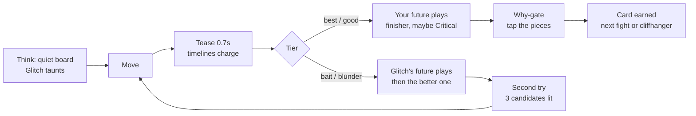

# Shockmate Overhaul Plan — Timeline Split

2026-09-16 · David (with Claude). Living copy: https://claude.ai/code/artifact/73839b7f-e1e8-4f13-a65e-ce725a30b4e1

## 1. Where the repo stands (audited 2026-09-16)

The live build is unplayable past the first move, both Node tests fail, and two of the twelve fights teach wrong chess. The good bones (pure logic modules, baked legal moves, spacing intervals) are worth keeping; the arena, the theme and the plan are not.

| Area | Claimed in CONTINUATION.md | Actual state on GitHub `main` (commit 09cfeb3) |
| --- | --- | --- |
| Arena `web/game.js` | Full arena, \~901 lines | v0.1, 269 lines. Never enables Next after the why-card; why buttons render empty; Retry, History, Duel, Palace-walk buttons unbound. Player is stuck after fight 1. |
| Two futures | Animated on the board | `encounters.js` has no `bestLineUci` / `temptingLineUci`, so only the first move of each future could ever play. The recapture, the mate, the consequence never appear. |
| Tests | Run the three test files | `test_futures.js` fails (missing line data). `test_score.js` fails at line 17. `test_encounters.py` passes (legality only). |
| Pieces | SVG Staunton | Works via MutationObserver, but crude shapes and low contrast for black pieces on dark squares. |
| Local source of truth | `/home/workdir/artifacts/shockmate/` | That is Grok's sandbox path, not a repo or a device. Treat the 901-line file as lost unless David has a copy. |
| Hits | Move + why | Hit = exact engine move only. Any equally good move is scored as a miss. |

**Content defects found with python-chess**

| Fight | Problem | Fix |
| --- | --- | --- |
| 06 Frozen Lunch | Bxc6+ is answered by bxc6: an even trade, not a won piece. The why ("take the frozen lunch") is false. | Rebuild the position so the pinned piece is actually lost, or move it to a "pile on the pin" lesson. |
| 11 Hidden Laser | Nxd6+ is a direct knight check; the bishop on e2 gives no check. Motif, story and finisher are all wrong. | Rebuild as a real discovered attack or relabel as "knight eats the queen with check." |
| 04 Poison Lunch | Only Qd4 counts. Qe3+, Qd3 and 20 other safe moves are scored as misses even though the lesson is "don't take the poisoned bishop." | Fairness tiers (section 5). |
| 05 Thumbtack | Bb5 wins a pawn at best, not the knight. "The knight cannot run" overstates it. | Re-verify with engine margin; rewrite the why. |

**Design defects**

- Theme: gore-lite "basement," dark brown, a "Violence flavor" setting. Copy is cryptic poetry ("The reason explodes," "Walk rooms that are due"). An 8-year-old cannot parse it.
- The why-gate is a two-sentence reading quiz whose decoy is another fight's sentence, so it is both reading-heavy and trivially gameable.
- "Variable spectacle" is a slogan; every hit fires the identical splat. No anticipation, no build-up.
- Streak resets to zero on any miss and the HUD shows miss counts. For a kid who already feels she never wins, this is a punishment loop.
- The plan spends the next three steps polishing finishers and review scheduling on a loop no child has played.

## 2. Who we are building for

Two players on one device with opposite failure modes: he quits when it feels like school, she quits when it feels like losing. Every system below has to pass both filters, and the two must never be scored against each other.

|  | Player A: boy, 8 | Player B: girl, 10 |
| --- | --- | --- |
| Strength | Strong at 400 level; fast pattern spotter | Persistent; puts in effort |
| Risk | Impatient; rejects anything that smells like study | Frustrates fast; believes she never wins |
| What hooks him / her | Beating Glitch fast, secret harder fights, being trusted with hard boards | Visible, permanent progress; wins that feel earned; a game she can beat |
| What kills it | Reading walls, forced explanations, slow animations he cannot skip, babyish difficulty | "Wrong," streak resets, miss counters, losing to her brother, dead ends with no way to win |

**Rules these two force**

1. Per-kid profiles. Separate progress, separate adaptive difficulty, separate collections. Neither sees the other's numbers.
2. Nothing on screen ever goes down. No streak-to-zero, no miss count. The only counters are fights won, criticals, and cards collected. A miss adds nothing; it never subtracts.
3. Every fight is winnable this session. A miss becomes "second try" on the same board with the candidate moves narrowed to three. A second miss shows the answer as a Glitch confession, then the kid plays it once and still earns the card. Retries count fully.
4. Skip and speed are first-class. Any animation can be tapped through. The why-gate is at most two taps. He can turn on Blitz mode (a soft 10-second bar that speeds the fight up, never a lockout).
5. Difficulty is hidden and per-kid. The game tracks tier hits (best / good / bait / blunder) and adjusts which fights come next and how many candidate moves are pre-highlighted. It never announces a level change downward.
6. Sibling mode is co-op by default: both kids versus Glitch on the same board, alternating fights, shared Glitch-rage meter. Head-to-head duel exists but is opt-in and handicap-balanced (she gets the narrowed board, he does not).
7. Effort gets credit. Her session summary counts "traps survived" and "Glitch tries wasted"; a fight won on the third try reads "Glitch needed 3 traps to get you. You still won."
8. Study is invisible. No lessons, no lectures, no "review due" chores. Spaced review is smuggled into the session as a "Glitch rematch" the villain demands.

## 3. Principles the plan is built on

The learning science says retrieve, space, and self-explain; the ADHD literature says short, simple, rewarded, and multiplayer; game design says build anticipation before the reveal and vary the spectacle, never the credit.

**Learning science (keep what already works, fix the delivery)**

- Retrieval practice beats re-reading. The why-gate is retrieval; it stays, but on the board (tap the pieces), not as a reading task.
- Spacing (1 / 3 / 7 days) is already in `score.js`. Keep the intervals; hide the mechanism inside "Glitch rematches."
- Self-explanation deepens transfer. Tapping the two forked pieces is a self-explanation a non-reader can perform.
- Immediate corrective feedback, then a chance to act on it. Hence second-try on the same board rather than moving on.
- Interleave motifs inside a session instead of blocking by room. `pickNextIndex` already prefers misses; extend it to mix motifs.
- Do not train a false heuristic. "Never take the free piece" is wrong chess, so some fights make the capture the right answer.

**ADHD-specific guidance**

- A review of inclusive design for children with ADHD lists simple interactivity, recurring rewards through positive feedback, removal of distracting elements, emphasis on relevant elements, level flexibility, reduced level duration, and a multiplayer option ([Silva, Maneira, Villachan-Lyra](https://gamilearning.ulusofona.pt/wp-content/uploads/full_P2L_Proceedings-30-45.pdf)).
- Multisensory feedback (visual, sound, touch) with instant reward supports attention and motivation in children with ADHD ([Frontiers in Education, 2025](https://www.frontiersin.org/journals/education/articles/10.3389/feduc.2025.1668260/full)).
- A design-principles prototype for students with ADHD recommends short modular chapters, immediate encouraging context-sensitive feedback, and visible progress through quests and badges ([arXiv 2606.29482](https://arxiv.org/pdf/2606.29482)).
- Practical translation: one fight is under 60 seconds; one session is 3 to 5 minutes; every screen has one job; rewards land within 300 ms of the move.

**Game design**

- Anticipation before reveal. The tease window (board dims, timelines charge, heartbeat) is the same lever a slot tease uses: uncertainty about which reveal you get, never about whether you earned it.
- Juice: hit-stop, screen shake, slow-motion zoom on criticals, comic bursts. Cheap in CSS, huge in feel.
- Variable reward in form, fixed in credit. Roughly one hit in six rolls a Critical with a bigger finisher and a Glitch meltdown. The card is earned every time. No loot boxes, no purchases, no energy timers.
- A villain to outsmart. Kids forgive a hard board when it is a trickster's fault and celebrate when he loses. Glitch carries the story so the copy can stay short.
- Cliffhanger endings. The session ends with a peek at the next board so the return trip starts before they put the phone down.

## 4. The experience

Timeline Split: the kid is a time agent, every move splits time in two, and Glitch, a purple pixel-edged time-goblin, keeps dangling bait to steer them into the bad timeline. Concept screens: [Shockmate — Timeline Split concept](https://claude.ai/artifact/UvtVosoKFKnmUFLhbpnLQ7).

**Look ("neon comic")**

| Token | Value | Use |
| --- | --- | --- |
| Ground | `#10163a` navy, radial `#26307a` glow at top | Every screen |
| Board | light `#e3e9ff`, dark `#4d63bf` | Friendly, high contrast |
| Cyan | `#33e0ff` | The kid's timeline, progress, primary button |
| Magenta | `#ff4fa3` | Glitch, bait, his timeline |
| Gold | `#ffcc33` | Criticals and bosses only. Never elsewhere, so it stays special |
| Display type | Bangers | Impact words only: YOUR MOVE, CRITICAL!, MISSION COMPLETE |
| Body type | Nunito 700–900 | Everything a kid reads |
| Pieces | White `#fff4d2` on `#2b2358` ink; black `#2a2452` on `#dde5ff` ink | Readable on both squares; keep the repo's Staunton paths, restroke |
| Intensity | Cartoon slapstick only | Stars, POW bursts, pieces tumbling off the board. No blood, no gore, no "violence" setting |

**Glitch**

- Four faces: taunt (think window), nervous (split), rage (kid wins), hide (why-gate). Add "smug" for when the kid bites.
- Glitch always lies. "Show the bait" reveals what Glitch wants, which teaches the kid to read the trap.
- Glitch's lines are 6 to 12 words, one per screen, and can be tapped away.
- He never wins permanently. When the kid bites, Glitch gloats for one beat and the second try begins.

**One fight, start to finish (target under 60 seconds)**



Quiet during the think window: no timer, no pulsing, Glitch static. Loud after the move.

**Screens**

| Screen | Job | Concept board |
| --- | --- | --- |
| Home | Pick player, big Play, small Co-op | to design |
| Think | Board, Glitch taunt, YOUR MOVE, Show the bait / Skip | 1 |
| Split | Dimmed board, crack of light, two charging timelines | 2 |
| Consequence | Future plays out on the board, POW burst, badge, Critical when rolled | 3 |
| Why-gate | Tap N pieces on the board, progress dots, hint | 4 |
| Cliffhanger | Mission complete, path map, next-board peek, Glitch threat | 5 |
| Collection | Motif cards earned, replaces the palace | to design |
| Parent | Session cap, sound, blitz allowed, reset per kid, weekly summary | to design |

**Sound**

- Replace oscillator beeps with short recorded SFX: select, move, charge, split-crack, pow, critical fanfare, Glitch grumble, Glitch scream, card earned.
- Optional voice lines for Glitch via a small set of pre-recorded clips (about 20). Browser TTS as a fallback behind a parent toggle.
- Sound is loud after the move and silent during the think window.

## 5. Core systems

Seven systems, each specified so a subagent can build and test it in isolation.

**5.1 Fairness tiers (replaces exact-match hits)**

Every legal move carries a pre-baked engine score. A move is graded by its gap to the best move, in centipawns, with mate treated as 10000.

| Tier | Rule | What the kid sees |
| --- | --- | --- |
| best | gap 0, or the same mate | Your future plays; Critical eligible |
| good | gap under 60 and not the bait | Your future plays; Glitch grumbles "there was a BIGGER one"; optional peek at best; card still earned |
| bait | the tempting move | Glitch gloats; his future plays; second try |
| blunder | gap over 60, not the bait | Glitch's future plays; second try |

Authoring rule: a fight only ships if best beats bait by at least 150 cp (or mate vs. no mate) and the why can be shown on the board in one continuation.

**5.2 Tease, verdict, consequence**

- Tease: 700 ms. Board to 45 % opacity, moved piece wobbles, crack of light across the board, both timeline bars charge, heartbeat SFX. Tap skips to the verdict.
- Verdict: banner + Glitch face swap within 100 ms of the tease ending.
- Consequence: the relevant future plays at 450 ms per ply from the continuation line, ending on the motif finisher. On a miss, Glitch's future plays first, then a reset, then the better one. Tap skips a ply; hold skips all.

**5.3 Finisher pool**

- Per motif: two normal finishers and one Critical finisher. Fork: both targets flash, then the losing piece tumbles off. Pin: the pinned piece gets a cartoon thumbtack and freezes blue. Skewer: a beam passes through the king to the piece behind. Back rank: a door slams across rank 8. Discovery: the unmasked piece fires a laser. Counting: the recaptured piece wears a poison-green ring.
- Critical roll: 1 in 6 on a best-tier hit, guaranteed on boss fights, never twice in a row. Critical = 180 ms hit-stop, zoom to 1.15, slow-motion tumble, gold burst, Glitch rage, fanfare.
- Variation is in the spectacle only. Credit and card are identical across rolls.

**5.4 Why-gate on the board**

- Each fight declares `whyTargets`: the squares the kid must tap and a prompt under 8 words. Fork: the two attacked pieces. Pin: the pinned piece and its king. Skewer: the king and the piece behind. Back rank: the three blocking pawns. Counting: the piece that takes back. Hanging: the loose piece.
- Correct tap: ring locks cyan, progress dot fills. Wrong tap: gentle shake, no penalty, Glitch says "nope" once.
- Hint after two wrong taps highlights one target. The gate always completes; it cannot fail the fight.
- Optional battle cry (three tap-to-build words) is off by default; enable per kid in Parent.

**5.5 Profiles and adaptive difficulty**

- `localStorage` key per profile: `shockmate-v2:<profileId>`. Two named profiles on the home screen, one tap to switch.
- Adaptation signal: rolling tier history over the last 8 fights. Two baits or blunders in a row: the next fight pre-highlights three candidate origin squares. Three best in a row: unlock a boss early and stop pre-highlighting. Never announced downward.
- Blitz mode per profile: a 10-second bar that speeds SFX and Glitch; when it empties, the fight continues with the candidates lit. Never a lockout.

**5.6 Co-op and duel**

- Co-op (default sibling mode): alternate fights on one device, shared Glitch-rage meter that fills toward a joint boss, each kid's card goes to their own collection.
- Duel (opt-in): same board hot-seat, why-gate decides. Handicap: the profile with the lower rolling tier average gets the three-candidate highlight.

**5.7 Progress and return**

- Path of 12 nodes with bosses at 4, 8, 12; bosses use the pack's hardest positions and guarantee a Critical on a best-tier hit.
- Collection: one card per fight (motif icon, title, the tapped squares), plus a rarer gold variant for a Critical.
- Session cap defaults to 6 fights, parent-set 3 to 12. The last screen is always the cliffhanger with the next board's peek and one Glitch threat.
- Spaced review appears inside a session as a "Glitch rematch" of a due fight, capped at 2 per session, drawn from `dueReviews`.

## 6. Data and engine changes

One generated file, `data/encounters.v2.json`, becomes the single source of truth; `web/encounters.js` is emitted from it by a script and never hand-edited.

**Encounter schema v2 (per fight)**

| Field | Type | Notes |
| --- | --- | --- |
| `id`, `title`, `motif`, `fen`, `turn` | as today |  |
| `best`, `bait` | UCI | `bait` replaces `tempting` |
| `moves` | `{uci: {san, cp, mate, tier}}` for every legal move | Scored by Stockfish 17 at depth 20; `tier` computed by the 5.1 rule at build time |
| `bestLine`, `baitLine` | UCI arrays, 2 to 5 plies | Must end where the why is visible on the board |
| `whyTargets` | `{prompt, squares[], hintSquare}` | Board-tap gate |
| `glitch` | `{taunt, gloat, rage}` | 6 to 12 words each |
| `finisher` | motif key + target squares | Computed by `motifTargets`, verified by test |
| `boss` | boolean | Positions 4, 8, 12 of the path |
| `legal` | packed as today | Kept for the browser's zero-illegal-move guarantee |

**Build pipeline**

1. `tools/build_encounters.py` reads `data/encounters.src.json` (hand-authored FEN, best, bait, lines, prompts), runs Stockfish over every legal move, computes tiers, asserts the authoring rule (best beats bait by 150 cp or mate), asserts every line is legal, and writes `encounters.v2.json` and `web/encounters.js`.
2. `tests/test_encounters.py` re-asserts legality, margins, line legality, and that `whyTargets` squares are occupied by the pieces the prompt names.
3. `tests/test_futures.js` and `tests/test_score.js` stay Node-only and must pass before any push.

**Content fixes in pack 1**

- 06: rebuild so the pinned piece is genuinely won, or reframe as "add a second attacker to the pinned piece."
- 11: rebuild as a true discovered attack (mover steps off the line; the unmasking piece hits the target), or retitle honestly.
- 04, 05: keep, but grading moves to tiers; rewrite 05's why to match what the engine actually wins.
- Add two "bait is real" fights where the capture is correct, so the villain cannot be beaten by a blanket rule.

**Engine in the browser**

None. All scoring is pre-baked so the game stays a static site on GitHub Pages and works offline. Stockfish runs only in the build script.

## 7. Phased build plan

Four phases, each ending in something the kids can play. A phase does not start until the previous gate passes, and the gate is always a real session with the kids, not a test suite.

| Phase | Scope | Gate to pass |
| --- | --- | --- |
| 0 · Playable truth (first) | Rebuild `web/game.js` from the tested modules; schema v2 + build script; fix 06 and 11; continuation lines for all 12; tiers; tests green; GitHub Pages on `main`; old theme untouched | Both kids finish 6 fights end to end on a phone with no dead end. Every miss reaches a second try. |
| 1 · Feel | Timeline Split skin; Glitch with four faces; tease/verdict/consequence; finisher pool + Critical roll; board-tap why-gate; recorded SFX; profiles; nothing-goes-down HUD | Kid A asks for "one more." Kid B wins a fight on a second try and says it counted. A Critical gets a reaction. |
| 2 · Return | Path map, bosses, collection, cliffhanger end, in-session Glitch rematches from `dueReviews`, co-op mode, duel handicap, Blitz toggle | Both kids come back unprompted on day 2 and day 4. Rematch fights are not recognized as "review." |
| 3 · Grow | Pack 2 (12 fights incl. two "bait is real"), parent weekly summary, voice lines, tablet layout | Parent summary matches what the kids report. No new dead ends. |

**Out of scope until Phase 3 ships:** openings, accounts, chat, online play, Chess.com sync, 3D.

**Sequencing inside Phase 0 (Claude Code, parallel where marked)**

1. Data agent (parallel): schema v2, `build_encounters.py`, Stockfish scoring, content fixes, tests.
2. Arena agent (parallel): new `game.js` state machine wired to `futures.js` and `score.js`; every button bound; second-try flow; profiles.
3. QA agent (after 1 and 2): Playwright phone-viewport run through all 12 fights on hit, bait, blunder, and second-try paths; asserts no disabled dead ends and no console errors.
4. Lead: merge, tag `v0.3-playable`, enable Pages, update docs.

## 8. Claude Code team and kickoff

One Lead session in Claude Code (Opus) runs the build and spawns four subagents with hard file ownership; the Lead is the only one that merges, pushes and edits the docs. Chat sessions like this one review plans and concepts; they do not push code.

**Roles and ownership**

| Agent | Owns | Never touches |
| --- | --- | --- |
| Lead | `docs/`, merges, tags, GitHub Pages, `README.md` | Feature code directly |
| Data | `data/`, `tools/build_encounters.py`, `tests/test_encounters.py`, `web/encounters.js` (generated) | `web/game.js`, `web/styles.css` |
| Arena | `web/game.js`, `web/futures.js`, `web/score.js`, `tests/test_futures.js`, `tests/test_score.js` | Data files, theme CSS |
| Theme | `web/styles.css`, `web/pieces.js`, `web/glitch.js`, `web/sfx/`, `web/index.html` markup | Game logic, data |
| QA | `tests/e2e/`, Playwright config, bug reports as GitHub issues | Shipping fixes to files it does not own; it files issues to the owner |

**Working rules for every agent**

- Read `docs/PLAN.md` (this document, exported) and `docs/CONTINUATION.md` first. Do not read the old `AGENTS.md` roles; they are replaced.
- One branch per agent (`data/v2-schema`, `arena/state-machine`, `theme/timeline-split`, `qa/e2e`); small commits; the Lead rebases and merges to `main` in the Phase 0 order above.
- Run the three tests before every commit. A red test blocks the commit.
- Commits and code comments credit "Claude", never a model name.
- Product rules that cannot be broken: engine is judge, animation is teacher, no eval numbers on screen, no loot or purchases, nothing on screen goes down, every fight is winnable this session, quiet during the think window, loud after the move, cartoon slapstick only.
- When a spec is ambiguous, pick the option that removes a way for a kid to get stuck, note it in the commit body, and keep going. Ask David only for things in section 9.
- Verify on a 390 × 844 viewport with Playwright before declaring a screen done.
- Update `docs/CONTINUATION.md` at the end of every session: what shipped, what is red, next three steps. Keep it under 80 lines.

**Kickoff prompt for the Lead (paste into Claude Code in the repo root)**

```text
You are the Lead for Shockmate. Read docs/PLAN.md and docs/CONTINUATION.md, then run Phase 0 to completion without asking me questions unless they are listed in PLAN.md section 9.

1. Confirm the state: run node tests/test_futures.js, node tests/test_score.js, python3 tests/test_encounters.py and record the failures.
2. Spawn subagents in parallel with the ownership table in PLAN.md section 8:
   - Data: schema v2, tools/build_encounters.py with Stockfish scoring of every legal move, tiers per section 5.1, continuation lines for all 12 fights, fix fights 06 and 11, regenerate web/encounters.js, make test_encounters.py assert margins and line legality.
   - Arena: rewrite web/game.js as an explicit state machine (home > think > tease > consequence > whygate > next | cliffhanger) that uses futures.js and score.js, binds every control in index.html, implements second-try, tiers, and per-profile storage; make test_futures.js and test_score.js pass.
   - QA (after Data and Arena report done): Playwright at 390x844 through all 12 fights on best, good, bait, blunder and second-try paths; fail on any disabled dead end or console error.
3. Merge in the order Data, Arena, QA. Tag v0.3-playable. Enable GitHub Pages from main root and confirm https://dirac1974.github.io/shockmate/ loads and plays.
4. Rewrite docs/CONTINUATION.md for the next session, then stop and report: what shipped, what is red, and the Phase 1 branch plan.

Commits credit "Claude". Keep the old theme in Phase 0; Phase 1 replaces it.
```

## 9. Open decisions and what David supplies

The build can start with the defaults below; the only thing that changes the Phase 0 plan is whether the 901-line arena still exists.

| Decision | Default if unanswered | Why it matters |
| --- | --- | --- |
| Is the 901-line `web/game.js` from Grok's sandbox saved anywhere? | Assume lost; Arena agent rewrites from the tested modules | Saves a day if it exists; the rewrite is cleaner if it does not |
| Device | Phone first, tablet layout in Phase 3 | Board size, tap targets, split-screen futures |
| Profile names on the home screen | "Player 1" / "Player 2" until set in Parent | Kids should see their own names |
| Glitch voice | Recorded clips in Phase 3; browser TTS fallback off by default | TTS voices sound wrong to kids; clips need a session with a mic |
| Battle cry after the why-gate | Off for both kids | On only if either kid asks for it |
| Session cap | 6 fights | Short enough to end on a high, long enough to hit a boss every other session |
| Stockfish for the build script | Data agent installs it in the Claude Code environment | Needed to score every legal move; not shipped to the browser |

- [ ] David: answer the `game.js` question, or say "lost."
- [ ] David: paste the section 8 kickoff prompt into Claude Code and let it run Phase 0.
- [ ] David: after Phase 0, sit both kids down for 6 fights each and note where anyone got stuck or bored. That is the Phase 1 gate.
